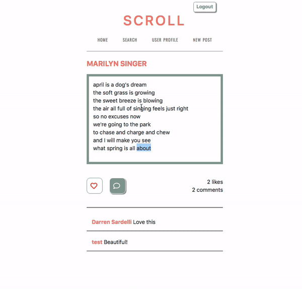

## SCROLL

Scroll is a social media app for readers and writers. Writers can post poetry, short stories and chapters, and gain followers without having to go through a publisher. Readers can discover new talent and always have new reading material.


## Visit the deployed version of Chewzy
[Scroll](https://pacific-everglades-31097.herokuapp.com/)
Checkout the full version of the app with these credentials:
```
email: test@test.com
```
```
password: test
```




______________
______________
______________

## Getting Started
to install locally run this command in your terminal
```
git clone https://github.com/innaleikina/scroll.git
```
once inside the Scroll folder run 
```
npm install
```
then go into the client folder and run
```
npm install
```
again

Also in your terminal on global level run 
```
mongod
```
To have the MongoDB working properly locally


### Prerequisites

* [Nodejs](https://nodejs.org/)
* [MongoDB](https://www.mongodb.com/)


______________
______________
______________
## Built With

* [Expressjs](https://expressjs.com/) - nodejs server side framework
* [Mongo](https://www.mongodb.com/) - flexible document data model 
* [Mongoose](https://mongoosejs.com/) - elegant mongodb object modeling for node.js
* [Passport](http://www.passportjs.org/) - authentication middleware for Node.js.
* [Bcrypt](https://www.npmjs.com/package/bcryptjs) - password encryption


______________
______________
______________
## Authors

* [Olga Serenchenko](https://github.com/oserenchenko)
* [Inna Leikina](https://github.com/innaleikina)

______________
______________
______________
## License

This project is licensed under the MIT License - see the [LICENSE.md](LICENSE.md) file for details